# DERAS — Unified Relational Database Schema

Single database schema (no module split). Relationships use explicit foreign keys. Many-to-many roles↔permissions use junction table `role_permission`.

---

## 1. Mermaid ER Diagram

```mermaid
erDiagram
    academic_years ||--o{ quotas : has
    townships ||--o{ quotas : has
    quotas ||--|{ quota_lines : has

    academic_years ||--o{ allocation_plans : has
    grades ||--o{ allocation_plans : has
    book_names ||--o{ allocation_plans : has
    allocation_plans ||--|{ allocation_plan_townships : has
    townships ||--o{ allocation_plan_townships : has

    academic_years ||--o{ textbooks : has
    townships ||--o{ textbooks : has
    grades ||--o{ textbooks : has
    book_names ||--o{ textbooks : has

    academic_years ||--o{ stocks : has
    townships ||--o{ stocks : has
    grades ||--o{ stocks : has
    book_names ||--o{ stocks : has

    academic_years ||--o{ previous_year_balances : has
    townships ||--o{ previous_year_balances : has
    grades ||--o{ previous_year_balances : has
    book_names ||--o{ previous_year_balances : has

    grades ||--o{ grade_book_names : has
    book_names ||--o{ grade_book_names : has
    categories ||--o{ grade_book_names : has

    academic_years ||--o{ school_counts : has
    grades ||--o{ school_counts : has
    townships ||--o{ school_counts : has

    academic_years ||--o{ teacher_guides : has
    grades ||--o{ teacher_guides : has
    book_names ||--o{ teacher_guides : has
    teacher_guides ||--|{ teacher_guide_township_allocations : has
    townships ||--o{ teacher_guide_township_allocations : has
    teacher_guides ||--o{ teacher_guide_issues : has
    teacher_guide_issues ||--|{ teacher_guide_issue_townships : has
    townships ||--o{ teacher_guide_issue_townships : has
    teacher_guides ||--o{ teacher_guide_summaries : has

    school_supply_items ||--o{ school_supply_allocations : has
    academic_years ||--o{ school_supply_allocations : has
    grades ||--o{ school_supply_allocations : has
    townships ||--o{ school_supply_allocations : has

    supply_items ||--o{ supply_details : has
    academic_years ||--o{ supply_details : has
    townships ||--o{ supply_details : has
    grades ||--o{ supply_details : has

    roles ||--o{ users : has
    roles ||--o{ role_permission : has
    permissions ||--o{ role_permission : has

    academic_years {
        bigint id PK
        varchar name UK
        smallint start_year
        smallint end_year
        boolean is_active
        boolean is_current
        varchar status
    }

    townships {
        bigint id PK
        varchar name
        boolean is_active
    }

    grades {
        bigint id PK
        varchar name
        boolean is_active
    }

    book_names {
        bigint id PK
        varchar name
        boolean is_active
    }

    categories {
        bigint id PK
        varchar slug UK
        varchar name_en
        varchar name_mm
        boolean is_active
    }

    grade_book_names {
        bigint id PK
        bigint grade_id FK
        bigint book_name_id FK
        bigint category_id FK
    }

    quotas {
        bigint id PK
        bigint academic_year_id FK
        bigint township_id FK
    }

    quota_lines {
        bigint id PK
        bigint quota_id FK
        varchar school_level
        varchar ownership
        int quantity
    }

    allocation_plans {
        bigint id PK
        bigint academic_year_id FK
        bigint grade_id FK
        bigint book_name_id FK
        int sequence_no
        int received_books
        int books_per_package
    }

    allocation_plan_townships {
        bigint id PK
        bigint allocation_plan_id FK
        bigint township_id FK
        int previous
        int total_students
        int transferable
    }

    textbooks {
        bigint id PK
        bigint academic_year_id FK
        bigint township_id FK
        bigint grade_id FK
        bigint book_name_id FK
        int books_per_set
        int student_count
    }

    stocks {
        bigint id PK
        bigint academic_year_id FK
        bigint township_id FK
        bigint grade_id FK
        bigint book_name_id FK
        int previous_balance
        int transferred
        int required_qty
    }

    previous_year_balances {
        bigint id PK
        bigint academic_year_id FK
        bigint township_id FK
        bigint grade_id FK
        bigint book_name_id FK
        int balance
    }

    school_counts {
        bigint id PK
        bigint academic_year_id FK
        bigint grade_id FK
        bigint township_id FK
        int school_count
    }

    teacher_guides {
        bigint id PK
        bigint academic_year_id FK
        bigint grade_id FK
        bigint book_name_id FK
        varchar guide_type
        int kg_to_g12_quota
        int g1_to_g5_quota
    }

    teacher_guide_township_allocations {
        bigint id PK
        bigint teacher_guide_id FK
        bigint township_id FK
        int kg_g12_qty
        int g1_g5_qty
    }

    teacher_guide_issues {
        bigint id PK
        bigint teacher_guide_id FK
        bigint academic_year_id FK
        bigint grade_id FK
        bigint book_name_id FK
        int district_unit
        int package_unit
    }

    teacher_guide_issue_townships {
        bigint id PK
        bigint teacher_guide_issue_id FK
        bigint township_id FK
        int issued_quantity
    }

    teacher_guide_summaries {
        bigint id PK
        bigint teacher_guide_id FK
        bigint academic_year_id FK
        bigint grade_id FK
        bigint book_name_id FK
        int previous_balance
        int fiscal_year_quota
        int distributed_books
    }

    school_supply_items {
        bigint id PK
        varchar name UK
        varchar rate
    }

    school_supply_allocations {
        bigint id PK
        bigint academic_year_id FK
        bigint grade_id FK
        bigint township_id FK
        bigint school_supply_item_id FK
        int school_count
        int quantity
    }

    supply_items {
        bigint id PK
        varchar name UK
    }

    supply_details {
        bigint id PK
        bigint academic_year_id FK
        bigint township_id FK
        bigint grade_id FK
        bigint supply_item_id FK
        int unit
        int issued_total
    }

    company_contacts {
        bigint id PK
        varchar company_name
        varchar lot
        varchar responsible_name
        varchar phone
    }

    roles {
        bigint id PK
        varchar name
        varchar slug UK
    }

    permissions {
        bigint id PK
        varchar name
        varchar slug UK
        varchar group
    }

    role_permission {
        bigint id PK
        bigint role_id FK
        bigint permission_id FK
    }

    users {
        bigint id PK
        varchar name
        varchar email UK
        bigint role_id FK
        varchar password
        enum role
    }
```



---

## 2. SQL CREATE TABLE Statements (unified, normalized)

```sql
-- =========================================================
-- DERAS unified schema (MySQL / MariaDB)
-- =========================================================

CREATE TABLE academic_years (
  id BIGINT UNSIGNED NOT NULL AUTO_INCREMENT PRIMARY KEY,
  name VARCHAR(255) NOT NULL UNIQUE,
  start_year SMALLINT UNSIGNED NULL,
  end_year SMALLINT UNSIGNED NULL,
  is_active TINYINT(1) NOT NULL DEFAULT 1,
  is_current TINYINT(1) NOT NULL DEFAULT 0,
  status VARCHAR(20) NOT NULL DEFAULT 'active',
  created_at TIMESTAMP NULL DEFAULT NULL,
  updated_at TIMESTAMP NULL DEFAULT NULL
) ENGINE=InnoDB DEFAULT CHARSET=utf8mb4 COLLATE=utf8mb4_unicode_ci;

CREATE TABLE townships (
  id BIGINT UNSIGNED NOT NULL AUTO_INCREMENT PRIMARY KEY,
  name VARCHAR(255) NOT NULL,
  is_active TINYINT(1) NOT NULL DEFAULT 1,
  created_at TIMESTAMP NULL DEFAULT NULL,
  updated_at TIMESTAMP NULL DEFAULT NULL
) ENGINE=InnoDB DEFAULT CHARSET=utf8mb4 COLLATE=utf8mb4_unicode_ci;

CREATE TABLE grades (
  id BIGINT UNSIGNED NOT NULL AUTO_INCREMENT PRIMARY KEY,
  name VARCHAR(255) NOT NULL,
  is_active TINYINT(1) NOT NULL DEFAULT 1,
  created_at TIMESTAMP NULL DEFAULT NULL,
  updated_at TIMESTAMP NULL DEFAULT NULL
) ENGINE=InnoDB DEFAULT CHARSET=utf8mb4 COLLATE=utf8mb4_unicode_ci;

CREATE TABLE book_names (
  id BIGINT UNSIGNED NOT NULL AUTO_INCREMENT PRIMARY KEY,
  name VARCHAR(255) NOT NULL,
  is_active TINYINT(1) NOT NULL DEFAULT 1,
  created_at TIMESTAMP NULL DEFAULT NULL,
  updated_at TIMESTAMP NULL DEFAULT NULL
) ENGINE=InnoDB DEFAULT CHARSET=utf8mb4 COLLATE=utf8mb4_unicode_ci;

CREATE TABLE categories (
  id BIGINT UNSIGNED NOT NULL AUTO_INCREMENT PRIMARY KEY,
  slug VARCHAR(255) NOT NULL UNIQUE,
  name_en VARCHAR(255) NOT NULL,
  name_mm VARCHAR(255) NOT NULL,
  is_active TINYINT(1) NOT NULL DEFAULT 1,
  created_at TIMESTAMP NULL DEFAULT NULL,
  updated_at TIMESTAMP NULL DEFAULT NULL
) ENGINE=InnoDB DEFAULT CHARSET=utf8mb4 COLLATE=utf8mb4_unicode_ci;

CREATE TABLE grade_book_names (
  id BIGINT UNSIGNED NOT NULL AUTO_INCREMENT PRIMARY KEY,
  grade_id BIGINT UNSIGNED NOT NULL,
  book_name_id BIGINT UNSIGNED NOT NULL,
  category_id BIGINT UNSIGNED NOT NULL,
  created_at TIMESTAMP NULL DEFAULT NULL,
  updated_at TIMESTAMP NULL DEFAULT NULL,
  CONSTRAINT fk_gbn_grade FOREIGN KEY (grade_id) REFERENCES grades(id) ON DELETE CASCADE,
  CONSTRAINT fk_gbn_book FOREIGN KEY (book_name_id) REFERENCES book_names(id) ON DELETE CASCADE,
  CONSTRAINT fk_gbn_category FOREIGN KEY (category_id) REFERENCES categories(id) ON DELETE CASCADE
) ENGINE=InnoDB DEFAULT CHARSET=utf8mb4 COLLATE=utf8mb4_unicode_ci;

CREATE TABLE company_contacts (
  id BIGINT UNSIGNED NOT NULL AUTO_INCREMENT PRIMARY KEY,
  company_name VARCHAR(255) NOT NULL,
  lot VARCHAR(255) NULL,
  responsible_name VARCHAR(255) NOT NULL,
  phone VARCHAR(255) NULL,
  is_active TINYINT(1) NOT NULL DEFAULT 1,
  created_at TIMESTAMP NULL DEFAULT NULL,
  updated_at TIMESTAMP NULL DEFAULT NULL
) ENGINE=InnoDB DEFAULT CHARSET=utf8mb4 COLLATE=utf8mb4_unicode_ci;

-- Auth (M:N roles ↔ permissions via junction)
CREATE TABLE roles (
  id BIGINT UNSIGNED NOT NULL AUTO_INCREMENT PRIMARY KEY,
  name VARCHAR(255) NOT NULL,
  slug VARCHAR(255) NOT NULL UNIQUE,
  description VARCHAR(255) NULL,
  created_at TIMESTAMP NULL DEFAULT NULL,
  updated_at TIMESTAMP NULL DEFAULT NULL
) ENGINE=InnoDB DEFAULT CHARSET=utf8mb4 COLLATE=utf8mb4_unicode_ci;

CREATE TABLE permissions (
  id BIGINT UNSIGNED NOT NULL AUTO_INCREMENT PRIMARY KEY,
  name VARCHAR(255) NOT NULL,
  slug VARCHAR(255) NOT NULL UNIQUE,
  `group` VARCHAR(255) NULL,
  created_at TIMESTAMP NULL DEFAULT NULL,
  updated_at TIMESTAMP NULL DEFAULT NULL
) ENGINE=InnoDB DEFAULT CHARSET=utf8mb4 COLLATE=utf8mb4_unicode_ci;

CREATE TABLE role_permission (
  id BIGINT UNSIGNED NOT NULL AUTO_INCREMENT PRIMARY KEY,
  role_id BIGINT UNSIGNED NOT NULL,
  permission_id BIGINT UNSIGNED NOT NULL,
  UNIQUE KEY role_permission_unique (role_id, permission_id),
  CONSTRAINT fk_rp_role FOREIGN KEY (role_id) REFERENCES roles(id) ON DELETE CASCADE,
  CONSTRAINT fk_rp_permission FOREIGN KEY (permission_id) REFERENCES permissions(id) ON DELETE CASCADE
) ENGINE=InnoDB DEFAULT CHARSET=utf8mb4 COLLATE=utf8mb4_unicode_ci;

CREATE TABLE users (
  id BIGINT UNSIGNED NOT NULL AUTO_INCREMENT PRIMARY KEY,
  name VARCHAR(255) NOT NULL,
  email VARCHAR(255) NOT NULL UNIQUE,
  role ENUM('super','admin') NOT NULL DEFAULT 'admin',
  role_id BIGINT UNSIGNED NULL,
  password VARCHAR(255) NOT NULL,
  email_verified_at TIMESTAMP NULL DEFAULT NULL,
  remember_token VARCHAR(100) NULL,
  created_at TIMESTAMP NULL DEFAULT NULL,
  updated_at TIMESTAMP NULL DEFAULT NULL,
  CONSTRAINT fk_users_role FOREIGN KEY (role_id) REFERENCES roles(id) ON DELETE SET NULL
) ENGINE=InnoDB DEFAULT CHARSET=utf8mb4 COLLATE=utf8mb4_unicode_ci;

-- Quotas (1:N header–detail)
CREATE TABLE quotas (
  id BIGINT UNSIGNED NOT NULL AUTO_INCREMENT PRIMARY KEY,
  academic_year_id BIGINT UNSIGNED NOT NULL,
  township_id BIGINT UNSIGNED NOT NULL,
  created_at TIMESTAMP NULL DEFAULT NULL,
  updated_at TIMESTAMP NULL DEFAULT NULL,
  UNIQUE KEY quotas_year_township_unique (academic_year_id, township_id),
  CONSTRAINT fk_quotas_year FOREIGN KEY (academic_year_id) REFERENCES academic_years(id) ON DELETE CASCADE,
  CONSTRAINT fk_quotas_township FOREIGN KEY (township_id) REFERENCES townships(id) ON DELETE CASCADE
) ENGINE=InnoDB DEFAULT CHARSET=utf8mb4 COLLATE=utf8mb4_unicode_ci;

CREATE TABLE quota_lines (
  id BIGINT UNSIGNED NOT NULL AUTO_INCREMENT PRIMARY KEY,
  quota_id BIGINT UNSIGNED NOT NULL,
  school_level VARCHAR(20) NOT NULL,
  ownership VARCHAR(20) NOT NULL DEFAULT '',
  quantity INT UNSIGNED NOT NULL DEFAULT 0,
  created_at TIMESTAMP NULL DEFAULT NULL,
  updated_at TIMESTAMP NULL DEFAULT NULL,
  UNIQUE KEY quota_lines_unique (quota_id, school_level, ownership),
  CONSTRAINT fk_quota_lines_quota FOREIGN KEY (quota_id) REFERENCES quotas(id) ON DELETE CASCADE
) ENGINE=InnoDB DEFAULT CHARSET=utf8mb4 COLLATE=utf8mb4_unicode_ci;

CREATE TABLE school_counts (
  id BIGINT UNSIGNED NOT NULL AUTO_INCREMENT PRIMARY KEY,
  academic_year_id BIGINT UNSIGNED NOT NULL,
  grade_id BIGINT UNSIGNED NOT NULL,
  township_id BIGINT UNSIGNED NULL,
  school_count INT UNSIGNED NOT NULL DEFAULT 0,
  created_at TIMESTAMP NULL DEFAULT NULL,
  updated_at TIMESTAMP NULL DEFAULT NULL,
  UNIQUE KEY school_counts_unique (academic_year_id, grade_id, township_id),
  CONSTRAINT fk_sc_year FOREIGN KEY (academic_year_id) REFERENCES academic_years(id) ON DELETE CASCADE,
  CONSTRAINT fk_sc_grade FOREIGN KEY (grade_id) REFERENCES grades(id) ON DELETE CASCADE,
  CONSTRAINT fk_sc_township FOREIGN KEY (township_id) REFERENCES townships(id) ON DELETE SET NULL
) ENGINE=InnoDB DEFAULT CHARSET=utf8mb4 COLLATE=utf8mb4_unicode_ci;

-- Allocation plans (1:N header–detail by township)
CREATE TABLE allocation_plans (
  id BIGINT UNSIGNED NOT NULL AUTO_INCREMENT PRIMARY KEY,
  academic_year_id BIGINT UNSIGNED NOT NULL,
  grade_id BIGINT UNSIGNED NOT NULL,
  book_name_id BIGINT UNSIGNED NOT NULL,
  sequence_no INT NOT NULL,
  received_books INT NOT NULL DEFAULT 0,
  books_per_package INT NOT NULL DEFAULT 0,
  ratio DECIMAL(12,4) NOT NULL DEFAULT 0.0000,
  eligible_students_total INT NOT NULL DEFAULT 0,
  allocated_books_total INT NOT NULL DEFAULT 0,
  student_count_total INT NOT NULL DEFAULT 0,
  transferable_books_total INT NOT NULL DEFAULT 0,
  available_total INT NOT NULL DEFAULT 0,
  surplus_shortage_total INT NOT NULL DEFAULT 0,
  remark TEXT NULL,
  created_at TIMESTAMP NULL DEFAULT NULL,
  updated_at TIMESTAMP NULL DEFAULT NULL,
  UNIQUE KEY allocation_plans_year_seq_unique (academic_year_id, sequence_no),
  CONSTRAINT fk_ap_year FOREIGN KEY (academic_year_id) REFERENCES academic_years(id) ON DELETE CASCADE,
  CONSTRAINT fk_ap_grade FOREIGN KEY (grade_id) REFERENCES grades(id) ON DELETE CASCADE,
  CONSTRAINT fk_ap_book FOREIGN KEY (book_name_id) REFERENCES book_names(id) ON DELETE CASCADE
) ENGINE=InnoDB DEFAULT CHARSET=utf8mb4 COLLATE=utf8mb4_unicode_ci;

CREATE TABLE allocation_plan_townships (
  id BIGINT UNSIGNED NOT NULL AUTO_INCREMENT PRIMARY KEY,
  allocation_plan_id BIGINT UNSIGNED NOT NULL,
  township_id BIGINT UNSIGNED NOT NULL,
  previous INT NOT NULL DEFAULT 0,
  total_students INT NOT NULL DEFAULT 0,
  transferable INT NOT NULL DEFAULT 0,
  created_at TIMESTAMP NULL DEFAULT NULL,
  updated_at TIMESTAMP NULL DEFAULT NULL,
  UNIQUE KEY ap_town_unique (allocation_plan_id, township_id),
  CONSTRAINT fk_apt_plan FOREIGN KEY (allocation_plan_id) REFERENCES allocation_plans(id) ON DELETE CASCADE,
  CONSTRAINT fk_apt_township FOREIGN KEY (township_id) REFERENCES townships(id) ON DELETE CASCADE
) ENGINE=InnoDB DEFAULT CHARSET=utf8mb4 COLLATE=utf8mb4_unicode_ci;

CREATE TABLE textbooks (
  id BIGINT UNSIGNED NOT NULL AUTO_INCREMENT PRIMARY KEY,
  academic_year_id BIGINT UNSIGNED NOT NULL,
  township_id BIGINT UNSIGNED NOT NULL,
  grade_id BIGINT UNSIGNED NOT NULL,
  book_name_id BIGINT UNSIGNED NOT NULL,
  books_per_set INT NOT NULL DEFAULT 0,
  student_count INT NOT NULL DEFAULT 0,
  book_count VARCHAR(255) NULL,
  remark VARCHAR(255) NULL,
  created_at TIMESTAMP NULL DEFAULT NULL,
  updated_at TIMESTAMP NULL DEFAULT NULL,
  UNIQUE KEY textbook_unique (academic_year_id, township_id, grade_id, book_name_id),
  CONSTRAINT fk_tb_year FOREIGN KEY (academic_year_id) REFERENCES academic_years(id) ON DELETE CASCADE,
  CONSTRAINT fk_tb_township FOREIGN KEY (township_id) REFERENCES townships(id) ON DELETE CASCADE,
  CONSTRAINT fk_tb_grade FOREIGN KEY (grade_id) REFERENCES grades(id) ON DELETE CASCADE,
  CONSTRAINT fk_tb_book FOREIGN KEY (book_name_id) REFERENCES book_names(id) ON DELETE CASCADE
) ENGINE=InnoDB DEFAULT CHARSET=utf8mb4 COLLATE=utf8mb4_unicode_ci;

CREATE TABLE stocks (
  id BIGINT UNSIGNED NOT NULL AUTO_INCREMENT PRIMARY KEY,
  academic_year_id BIGINT UNSIGNED NOT NULL,
  township_id BIGINT UNSIGNED NOT NULL,
  grade_id BIGINT UNSIGNED NOT NULL,
  book_name_id BIGINT UNSIGNED NOT NULL,
  previous_balance INT NOT NULL DEFAULT 0,
  transferred INT NOT NULL DEFAULT 0,
  enrolled_need INT NOT NULL DEFAULT 0,
  required_qty INT NOT NULL DEFAULT 0,
  remark VARCHAR(255) NULL,
  created_at TIMESTAMP NULL DEFAULT NULL,
  updated_at TIMESTAMP NULL DEFAULT NULL,
  UNIQUE KEY stock_unique (academic_year_id, township_id, grade_id, book_name_id),
  CONSTRAINT fk_stock_year FOREIGN KEY (academic_year_id) REFERENCES academic_years(id) ON DELETE CASCADE,
  CONSTRAINT fk_stock_township FOREIGN KEY (township_id) REFERENCES townships(id) ON DELETE CASCADE,
  CONSTRAINT fk_stock_grade FOREIGN KEY (grade_id) REFERENCES grades(id) ON DELETE CASCADE,
  CONSTRAINT fk_stock_book FOREIGN KEY (book_name_id) REFERENCES book_names(id) ON DELETE CASCADE
) ENGINE=InnoDB DEFAULT CHARSET=utf8mb4 COLLATE=utf8mb4_unicode_ci;

CREATE TABLE previous_year_balances (
  id BIGINT UNSIGNED NOT NULL AUTO_INCREMENT PRIMARY KEY,
  academic_year_id BIGINT UNSIGNED NOT NULL,
  township_id BIGINT UNSIGNED NOT NULL,
  grade_id BIGINT UNSIGNED NOT NULL,
  book_name_id BIGINT UNSIGNED NOT NULL,
  balance INT NOT NULL DEFAULT 0,
  created_at TIMESTAMP NULL DEFAULT NULL,
  updated_at TIMESTAMP NULL DEFAULT NULL,
  UNIQUE KEY pyb_unique (academic_year_id, township_id, grade_id, book_name_id),
  CONSTRAINT fk_pyb_year FOREIGN KEY (academic_year_id) REFERENCES academic_years(id) ON DELETE CASCADE,
  CONSTRAINT fk_pyb_township FOREIGN KEY (township_id) REFERENCES townships(id) ON DELETE CASCADE,
  CONSTRAINT fk_pyb_grade FOREIGN KEY (grade_id) REFERENCES grades(id) ON DELETE CASCADE,
  CONSTRAINT fk_pyb_book FOREIGN KEY (book_name_id) REFERENCES book_names(id) ON DELETE CASCADE
) ENGINE=InnoDB DEFAULT CHARSET=utf8mb4 COLLATE=utf8mb4_unicode_ci;

-- Teacher guides (family linked by teacher_guide_id)
CREATE TABLE teacher_guides (
  id BIGINT UNSIGNED NOT NULL AUTO_INCREMENT PRIMARY KEY,
  academic_year_id BIGINT UNSIGNED NOT NULL,
  grade_id BIGINT UNSIGNED NOT NULL,
  book_name_id BIGINT UNSIGNED NOT NULL,
  group_no INT NOT NULL DEFAULT 0,
  group_title TEXT NOT NULL,
  guide_type VARCHAR(255) NOT NULL,
  sequence_no INT NOT NULL DEFAULT 0,
  kg_to_g12_quota INT NOT NULL DEFAULT 0,
  g1_to_g5_quota INT NOT NULL DEFAULT 0,
  total_quota INT NOT NULL DEFAULT 0,
  remark TEXT NULL,
  created_at TIMESTAMP NULL DEFAULT NULL,
  updated_at TIMESTAMP NULL DEFAULT NULL,
  UNIQUE KEY teacher_guide_unique (academic_year_id, grade_id, book_name_id, guide_type, sequence_no),
  CONSTRAINT fk_tg_year FOREIGN KEY (academic_year_id) REFERENCES academic_years(id) ON DELETE CASCADE,
  CONSTRAINT fk_tg_grade FOREIGN KEY (grade_id) REFERENCES grades(id) ON DELETE CASCADE,
  CONSTRAINT fk_tg_book FOREIGN KEY (book_name_id) REFERENCES book_names(id) ON DELETE CASCADE
) ENGINE=InnoDB DEFAULT CHARSET=utf8mb4 COLLATE=utf8mb4_unicode_ci;

CREATE TABLE teacher_guide_township_allocations (
  id BIGINT UNSIGNED NOT NULL AUTO_INCREMENT PRIMARY KEY,
  teacher_guide_id BIGINT UNSIGNED NOT NULL,
  township_id BIGINT UNSIGNED NOT NULL,
  kg_g12_qty INT UNSIGNED NOT NULL DEFAULT 0,
  g1_g5_qty INT UNSIGNED NOT NULL DEFAULT 0,
  created_at TIMESTAMP NULL DEFAULT NULL,
  updated_at TIMESTAMP NULL DEFAULT NULL,
  UNIQUE KEY tg_town_alloc_unique (teacher_guide_id, township_id),
  CONSTRAINT fk_tgta_guide FOREIGN KEY (teacher_guide_id) REFERENCES teacher_guides(id) ON DELETE CASCADE,
  CONSTRAINT fk_tgta_township FOREIGN KEY (township_id) REFERENCES townships(id) ON DELETE CASCADE
) ENGINE=InnoDB DEFAULT CHARSET=utf8mb4 COLLATE=utf8mb4_unicode_ci;

CREATE TABLE teacher_guide_issues (
  id BIGINT UNSIGNED NOT NULL AUTO_INCREMENT PRIMARY KEY,
  teacher_guide_id BIGINT UNSIGNED NOT NULL,
  academic_year_id BIGINT UNSIGNED NOT NULL,
  grade_id BIGINT UNSIGNED NOT NULL,
  book_name_id BIGINT UNSIGNED NOT NULL,
  group_no INT UNSIGNED NOT NULL,
  group_title TEXT NOT NULL,
  guide_type VARCHAR(255) NOT NULL,
  sequence_no INT UNSIGNED NOT NULL,
  district_unit INT UNSIGNED NOT NULL DEFAULT 0,
  package_unit INT UNSIGNED NOT NULL DEFAULT 0,
  remark TEXT NULL,
  created_at TIMESTAMP NULL DEFAULT NULL,
  updated_at TIMESTAMP NULL DEFAULT NULL,
  UNIQUE KEY tgi_unique (academic_year_id, grade_id, book_name_id, guide_type, sequence_no),
  CONSTRAINT fk_tgi_guide FOREIGN KEY (teacher_guide_id) REFERENCES teacher_guides(id) ON DELETE CASCADE,
  CONSTRAINT fk_tgi_year FOREIGN KEY (academic_year_id) REFERENCES academic_years(id) ON DELETE CASCADE,
  CONSTRAINT fk_tgi_grade FOREIGN KEY (grade_id) REFERENCES grades(id) ON DELETE CASCADE,
  CONSTRAINT fk_tgi_book FOREIGN KEY (book_name_id) REFERENCES book_names(id) ON DELETE CASCADE
) ENGINE=InnoDB DEFAULT CHARSET=utf8mb4 COLLATE=utf8mb4_unicode_ci;

CREATE TABLE teacher_guide_issue_townships (
  id BIGINT UNSIGNED NOT NULL AUTO_INCREMENT PRIMARY KEY,
  teacher_guide_issue_id BIGINT UNSIGNED NOT NULL,
  township_id BIGINT UNSIGNED NOT NULL,
  issued_quantity INT NOT NULL DEFAULT 0,
  created_at TIMESTAMP NULL DEFAULT NULL,
  updated_at TIMESTAMP NULL DEFAULT NULL,
  CONSTRAINT fk_tgit_issue FOREIGN KEY (teacher_guide_issue_id) REFERENCES teacher_guide_issues(id) ON DELETE CASCADE,
  CONSTRAINT fk_tgit_township FOREIGN KEY (township_id) REFERENCES townships(id) ON DELETE CASCADE
) ENGINE=InnoDB DEFAULT CHARSET=utf8mb4 COLLATE=utf8mb4_unicode_ci;

CREATE TABLE teacher_guide_summaries (
  id BIGINT UNSIGNED NOT NULL AUTO_INCREMENT PRIMARY KEY,
  teacher_guide_id BIGINT UNSIGNED NOT NULL,
  academic_year_id BIGINT UNSIGNED NOT NULL,
  grade_id BIGINT UNSIGNED NOT NULL,
  book_name_id BIGINT UNSIGNED NOT NULL,
  group_no INT UNSIGNED NOT NULL,
  group_title TEXT NOT NULL,
  guide_type VARCHAR(255) NOT NULL,
  sequence_no INT UNSIGNED NOT NULL,
  previous_balance INT NULL,
  fiscal_year_quota INT NULL,
  total_books INT NULL,
  distributed_books INT NULL,
  remaining_books INT NULL,
  remark TEXT NULL,
  created_at TIMESTAMP NULL DEFAULT NULL,
  updated_at TIMESTAMP NULL DEFAULT NULL,
  UNIQUE KEY teacher_guide_summary_unique (academic_year_id, group_no, grade_id, book_name_id, guide_type, sequence_no),
  CONSTRAINT fk_tgs_guide FOREIGN KEY (teacher_guide_id) REFERENCES teacher_guides(id) ON DELETE CASCADE,
  CONSTRAINT fk_tgs_year FOREIGN KEY (academic_year_id) REFERENCES academic_years(id) ON DELETE CASCADE,
  CONSTRAINT fk_tgs_grade FOREIGN KEY (grade_id) REFERENCES grades(id) ON DELETE CASCADE,
  CONSTRAINT fk_tgs_book FOREIGN KEY (book_name_id) REFERENCES book_names(id) ON DELETE CASCADE
) ENGINE=InnoDB DEFAULT CHARSET=utf8mb4 COLLATE=utf8mb4_unicode_ci;

-- School supplies
CREATE TABLE school_supply_items (
  id BIGINT UNSIGNED NOT NULL AUTO_INCREMENT PRIMARY KEY,
  name VARCHAR(255) NOT NULL UNIQUE,
  rate VARCHAR(255) NULL,
  is_active TINYINT(1) NOT NULL DEFAULT 1,
  created_at TIMESTAMP NULL DEFAULT NULL,
  updated_at TIMESTAMP NULL DEFAULT NULL
) ENGINE=InnoDB DEFAULT CHARSET=utf8mb4 COLLATE=utf8mb4_unicode_ci;

CREATE TABLE school_supply_allocations (
  id BIGINT UNSIGNED NOT NULL AUTO_INCREMENT PRIMARY KEY,
  academic_year_id BIGINT UNSIGNED NOT NULL,
  grade_id BIGINT UNSIGNED NOT NULL,
  township_id BIGINT UNSIGNED NULL,
  school_supply_item_id BIGINT UNSIGNED NOT NULL,
  region VARCHAR(255) NULL,
  row_type ENUM('township','total','box','loose') NOT NULL DEFAULT 'township',
  row_label VARCHAR(255) NULL,
  school_count INT NOT NULL DEFAULT 0,
  quantity INT NOT NULL DEFAULT 0,
  remark VARCHAR(255) NULL,
  created_at TIMESTAMP NULL DEFAULT NULL,
  updated_at TIMESTAMP NULL DEFAULT NULL,
  KEY ssa_filter_idx (academic_year_id, grade_id, township_id),
  CONSTRAINT fk_ssa_year FOREIGN KEY (academic_year_id) REFERENCES academic_years(id) ON DELETE CASCADE,
  CONSTRAINT fk_ssa_grade FOREIGN KEY (grade_id) REFERENCES grades(id) ON DELETE CASCADE,
  CONSTRAINT fk_ssa_township FOREIGN KEY (township_id) REFERENCES townships(id) ON DELETE SET NULL,
  CONSTRAINT fk_ssa_item FOREIGN KEY (school_supply_item_id) REFERENCES school_supply_items(id) ON DELETE CASCADE
) ENGINE=InnoDB DEFAULT CHARSET=utf8mb4 COLLATE=utf8mb4_unicode_ci;

CREATE TABLE supply_items (
  id BIGINT UNSIGNED NOT NULL AUTO_INCREMENT PRIMARY KEY,
  name VARCHAR(255) NOT NULL UNIQUE,
  is_active TINYINT(1) NOT NULL DEFAULT 1,
  created_at TIMESTAMP NULL DEFAULT NULL,
  updated_at TIMESTAMP NULL DEFAULT NULL
) ENGINE=InnoDB DEFAULT CHARSET=utf8mb4 COLLATE=utf8mb4_unicode_ci;

CREATE TABLE supply_details (
  id BIGINT UNSIGNED NOT NULL AUTO_INCREMENT PRIMARY KEY,
  academic_year_id BIGINT UNSIGNED NOT NULL,
  township_id BIGINT UNSIGNED NOT NULL,
  grade_id BIGINT UNSIGNED NOT NULL,
  supply_item_id BIGINT UNSIGNED NOT NULL,
  sequence_no INT NOT NULL DEFAULT 0,
  unit INT NOT NULL DEFAULT 0,
  issued_total INT NOT NULL DEFAULT 0,
  package_count INT NOT NULL DEFAULT 0,
  loose_count INT NOT NULL DEFAULT 0,
  remark VARCHAR(255) NULL,
  created_at TIMESTAMP NULL DEFAULT NULL,
  updated_at TIMESTAMP NULL DEFAULT NULL,
  UNIQUE KEY supply_detail_unique (academic_year_id, township_id, grade_id, supply_item_id),
  CONSTRAINT fk_sd_year FOREIGN KEY (academic_year_id) REFERENCES academic_years(id) ON DELETE CASCADE,
  CONSTRAINT fk_sd_township FOREIGN KEY (township_id) REFERENCES townships(id) ON DELETE CASCADE,
  CONSTRAINT fk_sd_grade FOREIGN KEY (grade_id) REFERENCES grades(id) ON DELETE CASCADE,
  CONSTRAINT fk_sd_item FOREIGN KEY (supply_item_id) REFERENCES supply_items(id) ON DELETE CASCADE
) ENGINE=InnoDB DEFAULT CHARSET=utf8mb4 COLLATE=utf8mb4_unicode_ci;
```

### Cardinality summary

| Relationship | Type |
|---|---|
| academic_years → quotas, plans, textbooks, stocks, supplies, teacher_guides | 1:N |
| quotas → quota_lines | 1:N |
| allocation_plans → allocation_plan_townships | 1:N |
| teacher_guides → township_allocations / issues / summaries | 1:N |
| teacher_guide_issues → issue_townships | 1:N |
| roles ↔ permissions | M:N via `role_permission` |
| roles → users | 1:N |
