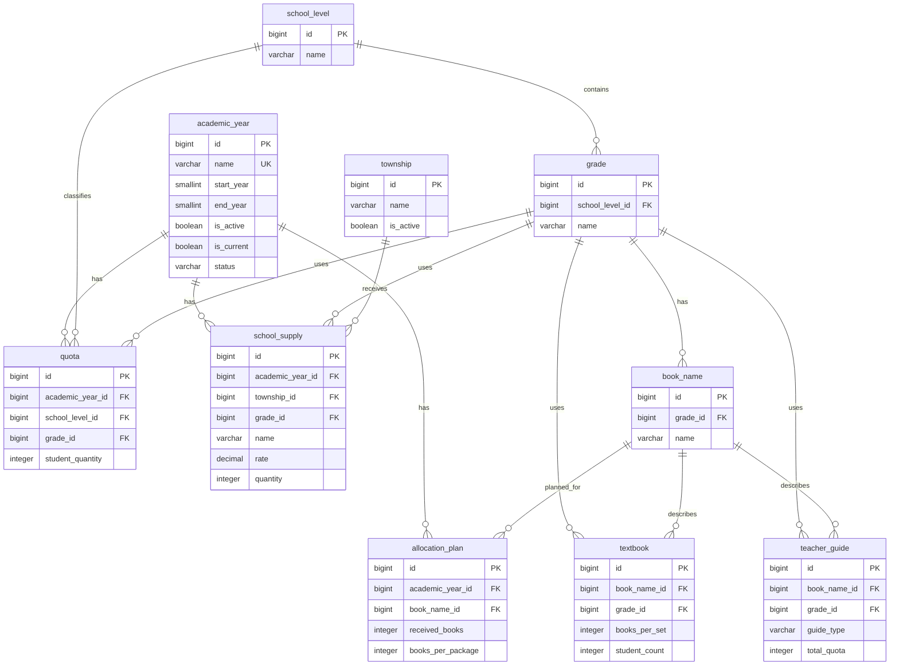

# Database Design for DERAS Main 10 Tables

## 1. Database Design Overview

This database design supports the core resource-allocation work of the District Education Resource Allocation System (DERAS). It stores academic years, townships, education levels, grades, book titles, student quotas, textbook allocation plans, textbooks, teacher guides, and school supplies.

The design uses primary keys to identify each record and foreign keys to connect related records. For example, a grade belongs to one school level, a book title belongs to one grade, and an allocation plan belongs to one academic year and one book title. These relationships reduce duplicate information and help keep allocation data accurate.

> Note: The current 10-table Quota design records a district-level student quantity by academic year, school level, and grade. To store a separate quota for every township, `township_id` must be added to the `quota` table in a later version.

## 2. Entity Relationship Diagram



## 3. Relationship Summary

1. **School Level → Grade**: One school level can contain many grades, but every grade belongs to one school level.
2. **Grade → Book Name**: One grade can have many book titles, while each book title is assigned to one grade.
3. **Academic Year → Quota / Allocation Plan / School Supply**: One academic year can have many related quota, plan, and supply records.
4. **Book Name → Allocation Plan / Textbook / Teacher Guide**: A book title can be used in multiple textbook-resource records, allocation plans, and teacher-guide records.
5. **Township → School Supply**: One township can receive many school-supply records.

## 4. MySQL `CREATE TABLE` Statements

```sql
CREATE DATABASE IF NOT EXISTS deras_db
    CHARACTER SET utf8mb4
    COLLATE utf8mb4_unicode_ci;

USE deras_db;

CREATE TABLE academic_year (
    id BIGINT UNSIGNED AUTO_INCREMENT PRIMARY KEY,
    name VARCHAR(255) NOT NULL,
    start_year SMALLINT NULL,
    end_year SMALLINT NULL,
    is_active BOOLEAN NOT NULL DEFAULT TRUE,
    is_current BOOLEAN NOT NULL DEFAULT FALSE,
    status VARCHAR(20) NOT NULL DEFAULT 'active',
    created_at TIMESTAMP NULL DEFAULT NULL,
    updated_at TIMESTAMP NULL DEFAULT NULL,
    CONSTRAINT uq_academic_year_name UNIQUE (name)
) ENGINE=InnoDB;

CREATE TABLE township (
    id BIGINT UNSIGNED AUTO_INCREMENT PRIMARY KEY,
    name VARCHAR(255) NOT NULL,
    is_active BOOLEAN NOT NULL DEFAULT TRUE,
    created_at TIMESTAMP NULL DEFAULT NULL,
    updated_at TIMESTAMP NULL DEFAULT NULL,
    CONSTRAINT uq_township_name UNIQUE (name)
) ENGINE=InnoDB;

CREATE TABLE school_level (
    id BIGINT UNSIGNED AUTO_INCREMENT PRIMARY KEY,
    name VARCHAR(100) NOT NULL,
    created_at TIMESTAMP NULL DEFAULT NULL,
    updated_at TIMESTAMP NULL DEFAULT NULL,
    CONSTRAINT uq_school_level_name UNIQUE (name)
) ENGINE=InnoDB;

CREATE TABLE grade (
    id BIGINT UNSIGNED AUTO_INCREMENT PRIMARY KEY,
    school_level_id BIGINT UNSIGNED NOT NULL,
    name VARCHAR(255) NOT NULL,
    created_at TIMESTAMP NULL DEFAULT NULL,
    updated_at TIMESTAMP NULL DEFAULT NULL,
    CONSTRAINT uq_grade_level_name UNIQUE (school_level_id, name),
    CONSTRAINT fk_grade_school_level
        FOREIGN KEY (school_level_id) REFERENCES school_level(id)
        ON UPDATE CASCADE ON DELETE RESTRICT
) ENGINE=InnoDB;

CREATE TABLE book_name (
    id BIGINT UNSIGNED AUTO_INCREMENT PRIMARY KEY,
    grade_id BIGINT UNSIGNED NOT NULL,
    name VARCHAR(255) NOT NULL,
    created_at TIMESTAMP NULL DEFAULT NULL,
    updated_at TIMESTAMP NULL DEFAULT NULL,
    CONSTRAINT uq_book_name_grade UNIQUE (grade_id, name),
    CONSTRAINT fk_book_name_grade
        FOREIGN KEY (grade_id) REFERENCES grade(id)
        ON UPDATE CASCADE ON DELETE RESTRICT
) ENGINE=InnoDB;

CREATE TABLE quota (
    id BIGINT UNSIGNED AUTO_INCREMENT PRIMARY KEY,
    academic_year_id BIGINT UNSIGNED NOT NULL,
    school_level_id BIGINT UNSIGNED NOT NULL,
    grade_id BIGINT UNSIGNED NOT NULL,
    student_quantity INT UNSIGNED NOT NULL,
    created_at TIMESTAMP NULL DEFAULT NULL,
    updated_at TIMESTAMP NULL DEFAULT NULL,
    CONSTRAINT uq_quota_year_level_grade
        UNIQUE (academic_year_id, school_level_id, grade_id),
    CONSTRAINT fk_quota_academic_year
        FOREIGN KEY (academic_year_id) REFERENCES academic_year(id)
        ON UPDATE CASCADE ON DELETE RESTRICT,
    CONSTRAINT fk_quota_school_level
        FOREIGN KEY (school_level_id) REFERENCES school_level(id)
        ON UPDATE CASCADE ON DELETE RESTRICT,
    CONSTRAINT fk_quota_grade
        FOREIGN KEY (grade_id) REFERENCES grade(id)
        ON UPDATE CASCADE ON DELETE RESTRICT
) ENGINE=InnoDB;

CREATE TABLE allocation_plan (
    id BIGINT UNSIGNED AUTO_INCREMENT PRIMARY KEY,
    academic_year_id BIGINT UNSIGNED NOT NULL,
    book_name_id BIGINT UNSIGNED NOT NULL,
    received_books INT UNSIGNED NOT NULL,
    books_per_package INT UNSIGNED NOT NULL,
    created_at TIMESTAMP NULL DEFAULT NULL,
    updated_at TIMESTAMP NULL DEFAULT NULL,
    CONSTRAINT uq_allocation_plan_year_book
        UNIQUE (academic_year_id, book_name_id),
    CONSTRAINT fk_allocation_plan_academic_year
        FOREIGN KEY (academic_year_id) REFERENCES academic_year(id)
        ON UPDATE CASCADE ON DELETE RESTRICT,
    CONSTRAINT fk_allocation_plan_book_name
        FOREIGN KEY (book_name_id) REFERENCES book_name(id)
        ON UPDATE CASCADE ON DELETE RESTRICT
) ENGINE=InnoDB;

CREATE TABLE textbook (
    id BIGINT UNSIGNED AUTO_INCREMENT PRIMARY KEY,
    book_name_id BIGINT UNSIGNED NOT NULL,
    grade_id BIGINT UNSIGNED NOT NULL,
    books_per_set INT UNSIGNED NOT NULL,
    student_count INT UNSIGNED NOT NULL,
    created_at TIMESTAMP NULL DEFAULT NULL,
    updated_at TIMESTAMP NULL DEFAULT NULL,
    CONSTRAINT uq_textbook_book_grade UNIQUE (book_name_id, grade_id),
    CONSTRAINT fk_textbook_book_name
        FOREIGN KEY (book_name_id) REFERENCES book_name(id)
        ON UPDATE CASCADE ON DELETE RESTRICT,
    CONSTRAINT fk_textbook_grade
        FOREIGN KEY (grade_id) REFERENCES grade(id)
        ON UPDATE CASCADE ON DELETE RESTRICT
) ENGINE=InnoDB;

CREATE TABLE teacher_guide (
    id BIGINT UNSIGNED AUTO_INCREMENT PRIMARY KEY,
    book_name_id BIGINT UNSIGNED NOT NULL,
    grade_id BIGINT UNSIGNED NOT NULL,
    guide_type VARCHAR(255) NOT NULL,
    total_quota INT UNSIGNED NOT NULL,
    created_at TIMESTAMP NULL DEFAULT NULL,
    updated_at TIMESTAMP NULL DEFAULT NULL,
    CONSTRAINT uq_teacher_guide_book_grade_type
        UNIQUE (book_name_id, grade_id, guide_type),
    CONSTRAINT fk_teacher_guide_book_name
        FOREIGN KEY (book_name_id) REFERENCES book_name(id)
        ON UPDATE CASCADE ON DELETE RESTRICT,
    CONSTRAINT fk_teacher_guide_grade
        FOREIGN KEY (grade_id) REFERENCES grade(id)
        ON UPDATE CASCADE ON DELETE RESTRICT
) ENGINE=InnoDB;

CREATE TABLE school_supply (
    id BIGINT UNSIGNED AUTO_INCREMENT PRIMARY KEY,
    academic_year_id BIGINT UNSIGNED NOT NULL,
    township_id BIGINT UNSIGNED NOT NULL,
    grade_id BIGINT UNSIGNED NOT NULL,
    name VARCHAR(255) NOT NULL,
    rate DECIMAL(10,2) NOT NULL,
    quantity INT UNSIGNED NOT NULL,
    created_at TIMESTAMP NULL DEFAULT NULL,
    updated_at TIMESTAMP NULL DEFAULT NULL,
    CONSTRAINT uq_school_supply_year_township_grade_name
        UNIQUE (academic_year_id, township_id, grade_id, name),
    CONSTRAINT fk_school_supply_academic_year
        FOREIGN KEY (academic_year_id) REFERENCES academic_year(id)
        ON UPDATE CASCADE ON DELETE RESTRICT,
    CONSTRAINT fk_school_supply_township
        FOREIGN KEY (township_id) REFERENCES township(id)
        ON UPDATE CASCADE ON DELETE RESTRICT,
    CONSTRAINT fk_school_supply_grade
        FOREIGN KEY (grade_id) REFERENCES grade(id)
        ON UPDATE CASCADE ON DELETE RESTRICT
) ENGINE=InnoDB;
```

## 5. Normalization Note

The design follows third normal form (3NF) for its main data. Master data is stored once in `academic_year`, `township`, `school_level`, `grade`, and `book_name`. Operational records store only the related foreign keys and their own quantities. This avoids repeatedly writing education-level, grade, book-title, or township names in allocation records.
